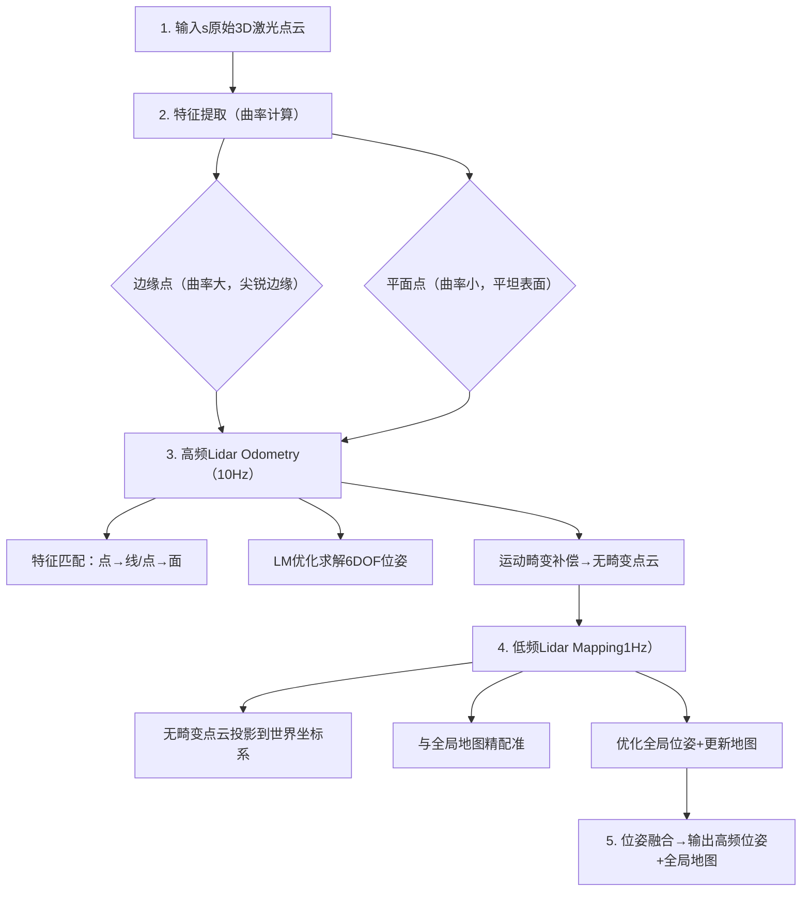

```mermaid
graph TD
    A[1. 输入s原始3D激光点云] --> B[2. 特征提取（曲率计算）]
    B --> C{边缘点（曲率大，尖锐边缘）}
    B --> D{平面点（曲率小，平坦表面）}
    C --> E[3. 高频Lidar Odometry（10Hz）]
    D --> E
    E --> F["特征匹配：点→线/点→面"]
    E --> G[LM优化求解6DOF位姿]
    E --> H[运动畸变补偿→无畸变点云]
    H --> I[4. 低频Lidar Mapping1Hz）]
    I --> J[无畸变点云投影到世界坐标系]
    I --> K[与全局地图精配准]
    I --> L[优化全局位姿+更新地图]
    L --> M[5. 位姿融合→输出高频位姿+全局地图]

```